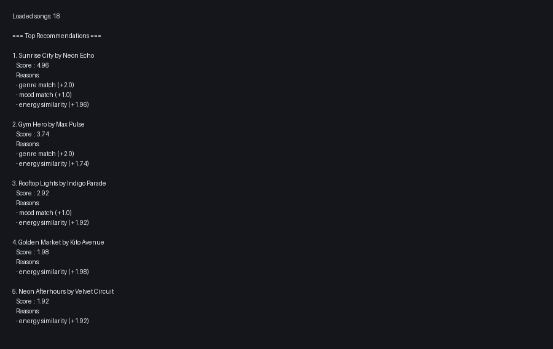
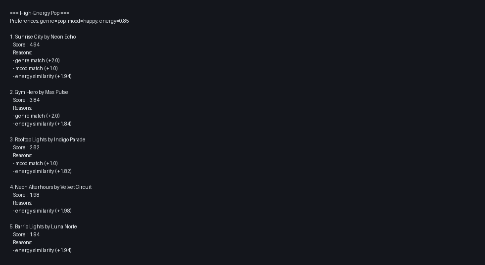
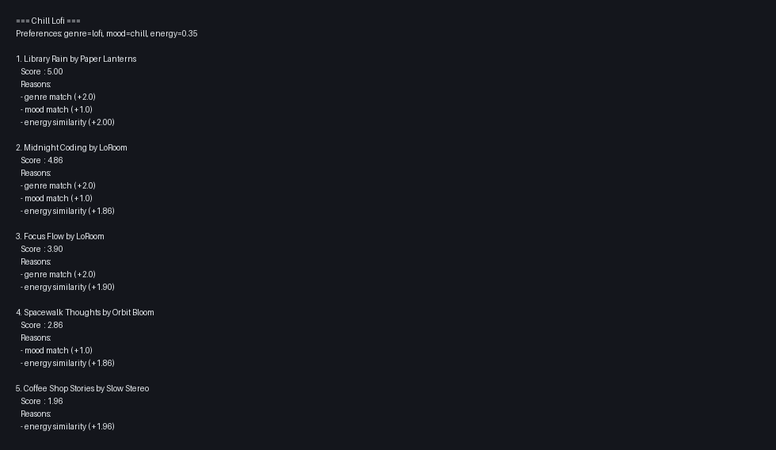
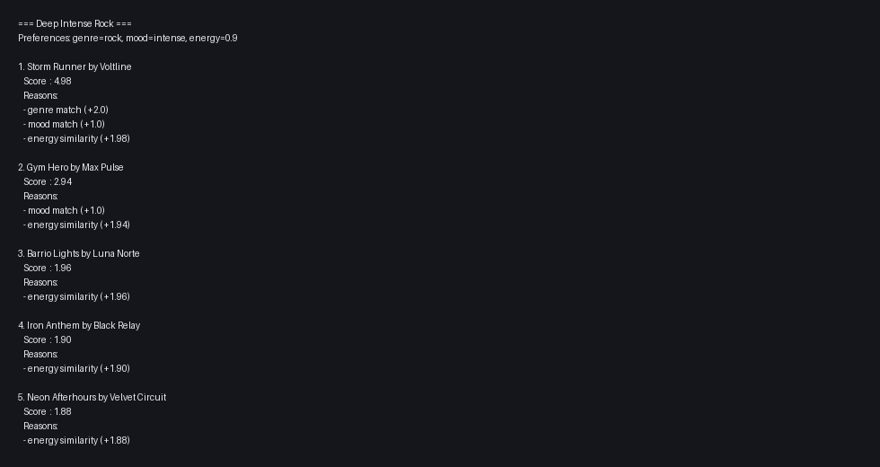
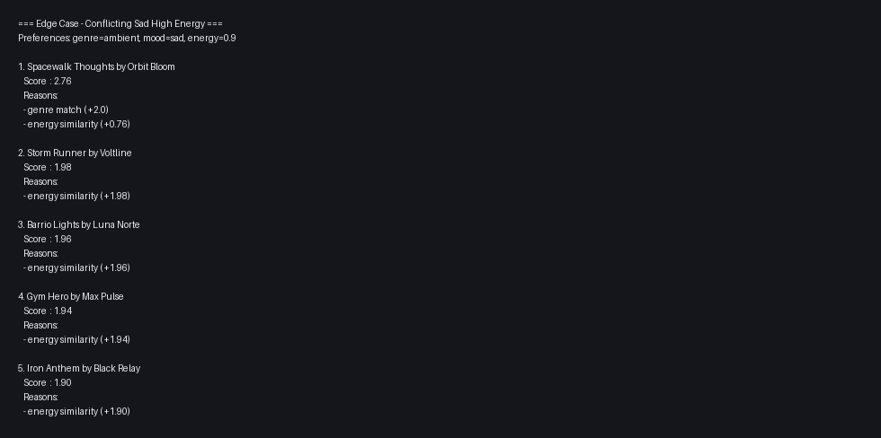
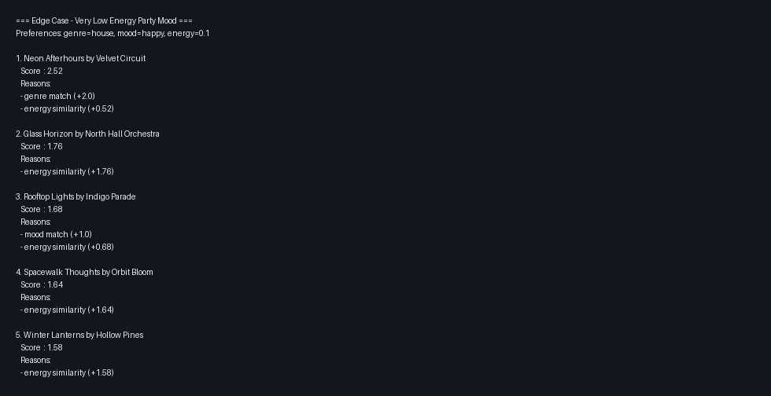

# 🎵 Music Recommender Simulation

## Project Summary

In this project you will build and explain a small music recommender system.

Your goal is to:

- Represent songs and a user "taste profile" as data
- Design a scoring rule that turns that data into recommendations
- Evaluate what your system gets right and wrong
- Reflect on how this mirrors real world AI recommenders

Replace this paragraph with your own summary of what your version does.

---

## How The System Works

Real-world recommendation systems combine content signals (audio features, metadata), behavior signals (likes, skips, watch time), and collaborative patterns across millions of users. At scale, platforms use layered pipelines: candidate generation to find a small set of likely matches, scoring models to estimate relevance, and ranking rules to balance personalization, freshness, and diversity. This simulation focuses on a transparent content-based approach by matching each song to a user taste profile and prioritizing vibe similarity through weighted feature closeness.

Song features used in this simulation:

- id
- title
- artist
- genre
- mood
- energy
- tempo_bpm
- valence
- danceability
- acousticness

UserProfile features used in this simulation:

- favorite_genre
- favorite_mood
- target_energy
- target_valence
- target_danceability
- likes_acoustic

Finalized Algorithm Recipe:

1. Input: collect user preferences (`favorite_genre`, `favorite_mood`, `target_energy`) and choose `k`.
2. Loop through every song in `songs.csv`.
3. Compute score for one song:
   - `+2.0` points for exact genre match.
   - `+1.0` point for exact mood match.
   - Energy similarity points: `2.0 * (1 - abs(song_energy - target_energy))`.
4. Save `(song, score, explanation)` for each song.
5. Ranking rule: sort songs by score from highest to lowest.
6. Output: return top-`k` songs as recommendations.

Potential Biases to Expect:

- This system may over-prioritize genre and miss cross-genre songs that still match the user mood and energy.
- Exact mood matching can be too strict, so near moods (for example `focused` vs `chill`) may be underrated.
- With a small catalog, frequent genres and artists can dominate results.

---

## Getting Started

### Setup

1. Create a virtual environment (optional but recommended):

   ```bash
   python -m venv .venv
   source .venv/bin/activate      # Mac or Linux
   .venv\Scripts\activate         # Windows

2. Install dependencies

```bash
pip install -r requirements.txt
```

3. Run the app:

```bash
python -m src.main
```

### Running Tests

Run the starter tests with:

```bash
pytest
```

You can add more tests in `tests/test_recommender.py`.

### Recommendation Output Screenshot

Run:

```bash
python -m src.main
```

Then paste your screenshot image at `docs/recommendations-terminal.png` and keep this embed:



Latest terminal output:

```text
Loaded songs: 18

=== Top Recommendations ===

1. Sunrise City by Neon Echo
   Score  : 4.96
   Reasons:
   - genre match (+2.0)
   - mood match (+1.0)
   - energy similarity (+1.96)

2. Gym Hero by Max Pulse
   Score  : 3.74
   Reasons:
   - genre match (+2.0)
   - energy similarity (+1.74)

3. Rooftop Lights by Indigo Parade
   Score  : 2.92
   Reasons:
   - mood match (+1.0)
   - energy similarity (+1.92)

4. Golden Market by Kito Avenue
   Score  : 1.98
   Reasons:
   - energy similarity (+1.98)

5. Neon Afterhours by Velvet Circuit
   Score  : 1.92
   Reasons:
   - energy similarity (+1.92)
```

### System Evaluation Profiles

Prompt used for Copilot Chat in a new System Evaluation session with codebase context:

Please review this recommender codebase and suggest adversarial user preference profiles that could expose weaknesses in this scoring logic. The current score uses +2.0 for genre match, +1.0 for mood match, and a continuous energy similarity term. Suggest edge-case profiles with conflicting or unusual preferences (for example very high energy with moods that are underrepresented), and explain what unexpected ranking behavior each profile might reveal.

Profiles evaluated in the CLI:

- High-Energy Pop: genre=pop, mood=happy, energy=0.85
- Chill Lofi: genre=lofi, mood=chill, energy=0.35
- Deep Intense Rock: genre=rock, mood=intense, energy=0.90
- Edge Case - Conflicting Sad High Energy: genre=ambient, mood=sad, energy=0.90
- Edge Case - Very Low Energy Party Mood: genre=house, mood=happy, energy=0.10

Screenshots of top-5 recommendations per profile:











---

## Experiments You Tried

I compared the recommendations for the **High-Energy Pop** profile to my own musical intuition, and the top result felt correct. The first recommendation was **Sunrise City**, which matches pop (+2.0), matches happy mood (+1.0), and is very close to the target energy of 0.85 (+1.94). Intuitively, this sounds like a track that should rank first for that vibe.

Inline Chat prompt used on the top-ranked result:

```text
Using #file:src/recommender.py and #file:src/main.py, explain why "Sunrise City" ranked #1 for the "High-Energy Pop" profile.
Break down the final score using current weights:
- +2.0 for genre match
- +1.0 for mood match
- +2.0 * (1 - abs(song_energy - target_energy)) for energy
Then compare that score to the #2 song and explain the margin.
```

Result summary from that analysis:

- Sunrise City total = 2.0 (genre) + 1.0 (mood) + 1.94 (energy) = **4.94**
- Gym Hero total = 2.0 (genre) + 0.0 (mood) + 1.84 (energy) = **3.84**
- Margin = **1.10**, mostly because Sunrise City gets the extra mood match.

Behavior check for repeated top songs:

- The same song did **not** appear first in every profile, which suggests some diversity.
- However, the edge-case profile **genre=ambient, mood=sad, energy=0.90** ranked an ambient song first even with poor energy alignment, showing that the +2.0 genre weight can dominate when mood labels are sparse.

Sensitivity test (weight shift):

- Experimental change applied in `score_song`: genre match reduced from `+2.0` to `+1.0`, and energy similarity increased from `2.0 * similarity` to `4.0 * similarity`.
- Most top-1 recommendations stayed the same for standard profiles (High-Energy Pop, Chill Lofi, Deep Intense Rock).
- Edge cases changed noticeably:
   - `ambient/sad/0.90` switched top-1 from **Spacewalk Thoughts** to **Storm Runner**.
   - `house/happy/0.10` switched top-1 from **Neon Afterhours** to **Glass Horizon**.
- Conclusion: the change made results mostly **different rather than universally more accurate**, but improved behavior for conflicting profiles by reducing genre lock-in.

---

## Limitations and Risks

Summarize some limitations of your recommender.

Examples:

- It only works on a tiny catalog
- It does not understand lyrics or language
- It might over favor one genre or mood

You will go deeper on this in your model card.

---

## Reflection

Read and complete `model_card.md`:

[**Model Card**](model_card.md)

Write 1 to 2 paragraphs here about what you learned:

- about how recommenders turn data into predictions
- about where bias or unfairness could show up in systems like this


---

## 7. `model_card_template.md`

Combines reflection and model card framing from the Module 3 guidance. :contentReference[oaicite:2]{index=2}  

```markdown
# 🎧 Model Card - Music Recommender Simulation

## 1. Model Name

Give your recommender a name, for example:

> VibeFinder 1.0

---

## 2. Intended Use

- What is this system trying to do
- Who is it for

Example:

> This model suggests 3 to 5 songs from a small catalog based on a user's preferred genre, mood, and energy level. It is for classroom exploration only, not for real users.

---

## 3. How It Works (Short Explanation)

Describe your scoring logic in plain language.

- What features of each song does it consider
- What information about the user does it use
- How does it turn those into a number

Try to avoid code in this section, treat it like an explanation to a non programmer.

---

## 4. Data

Describe your dataset.

- How many songs are in `data/songs.csv`
- Did you add or remove any songs
- What kinds of genres or moods are represented
- Whose taste does this data mostly reflect

---

## 5. Strengths

Where does your recommender work well

You can think about:
- Situations where the top results "felt right"
- Particular user profiles it served well
- Simplicity or transparency benefits

---

## 6. Limitations and Bias

Where does your recommender struggle

Some prompts:
- Does it ignore some genres or moods
- Does it treat all users as if they have the same taste shape
- Is it biased toward high energy or one genre by default
- How could this be unfair if used in a real product

---

## 7. Evaluation

How did you check your system

Examples:
- You tried multiple user profiles and wrote down whether the results matched your expectations
- You compared your simulation to what a real app like Spotify or YouTube tends to recommend
- You wrote tests for your scoring logic

You do not need a numeric metric, but if you used one, explain what it measures.

---

## 8. Future Work

If you had more time, how would you improve this recommender

Examples:

- Add support for multiple users and "group vibe" recommendations
- Balance diversity of songs instead of always picking the closest match
- Use more features, like tempo ranges or lyric themes

---

## 9. Personal Reflection

A few sentences about what you learned:

- What surprised you about how your system behaved
- How did building this change how you think about real music recommenders
- Where do you think human judgment still matters, even if the model seems "smart"

